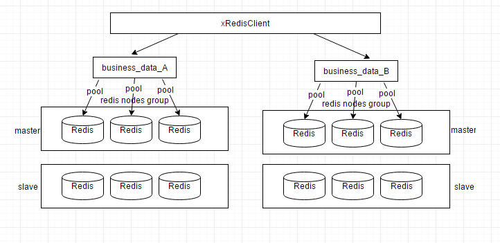

xRedis   
[](https://travis-ci.org/freeeyes/PSS)
[](https://opensource.org/licenses/Apache-2.0 )
[](https://badge.fury.io/gh/0xsky%2Fxredis)
======

C++ Redis client, support the data slice storage, redis cluster, connection pool, read/write separation.

**Features:**
* Support multi-node distributed storage of data, can customize the sharding rules;
* Support to connect to master and slave nodes of each shard at the same time, support separation of master and slave reads and writes;
* Support connection pooling for each storage node;
* Support simultaneous connection of multiple data sharding clusters;
* Support for connecting to official clusters, single or multiple nodes
    Support to set up a connection pool to each node, the client side automatically calculates the slot distribution.
    Support automatic calculation of node index position, support Redis cluster node change connection automatic switch;
    The connection pool to the cluster is automatically updated when the add/delete /slot distribution of the official cluster node changes.
* Provide easy to use C++ interface encapsulation, has implemented most of the Redis command;
* Only rely on the Hiredis library;
* Multi-thread safety
* Support password connection;
* Support Linux and Windows platforms

中文版说明文档[点这里](https://github.com/0xsky/xredis/blob/master/README-cn.md)

### Dependencies

xredis requires hiredis only

### Install

First step install libhiredis, on a Debian system you can use:

```bash
sudo apt-get install libhiredis-dev
```

on centos/redhat/fedora system you can use:
```bash
sudo yum install hiredis-devel
```

Then checkout the code and compile it
```bash
git clone https://github.com/0xsky/xredis
cd xredis
make
sudo make install
```

Usage
```C++
#Accessing redis or  redis Cluster using the xRedisClusterClient class

#include "xRedisClusterClient.h"
int main(int argc, char **argv) {
    xRedisClusterClient redisclient;
    # Connect to REDIS and establish a connection pool 
    # If this node is a member of the REDIS cluster, 
    # a connection pool is automatically established for each primary node in the cluster.
    std::string passwd = "passwd123";
    bool bRet = redisclient.connect("127.0.0.1", 6379, passwd, 4);

    RedisResult result;
    redisclient.command(result, "set %s %s", "key", "hello");
    
    printf("type:%d integer:%lld str:%s \r\n",
        result.type(), result.integer(), result.str());

   while (true) {
        usleep(1000*1000*6);
        redisclient.keepalive();
    }

    return 0;
}
```
### Todo
  Support redis sentinel 

### Documentation

[xRedis API Site](http://xredis.0xsky.com/) 
See [examples](https://github.com/0xsky/xredis/blob/master/examples) directory for some examples

blog: [xSky's Blog](https://0xsky.com/)
xRedis QQ Group: 190107312 

